## Web Application interface for manipulating the [College Chatbot](https://github.com/jhonas-palad/Chatbot-API.git)

Link: https://chatbotadmin.site/

## Description
This web application can be used for manipulating intents that serves as training dataset for the chatbot. The chatbot can be trained by simply clicking the Trainbot button and test it right away.

**Implemented using React JS**

### Screenshots
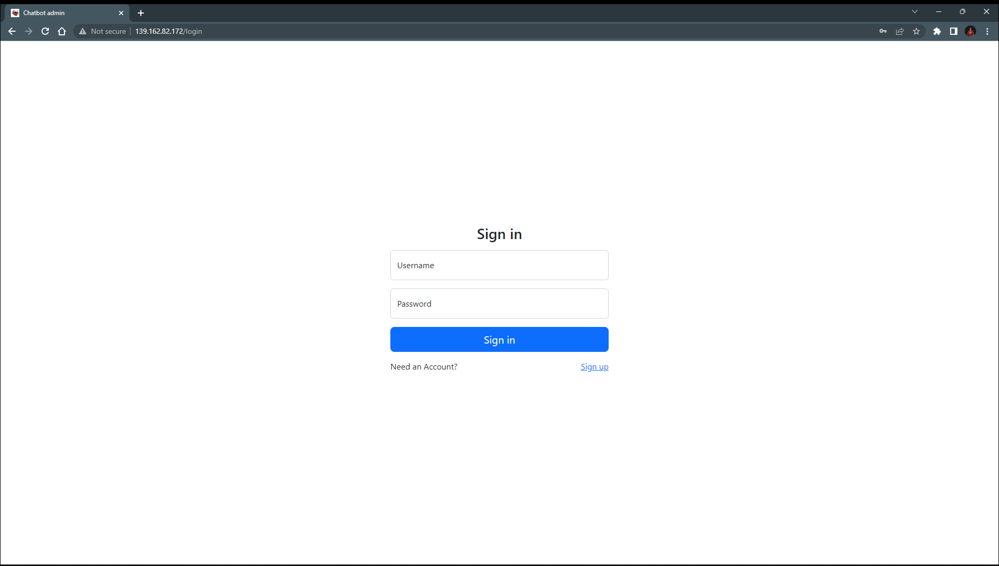
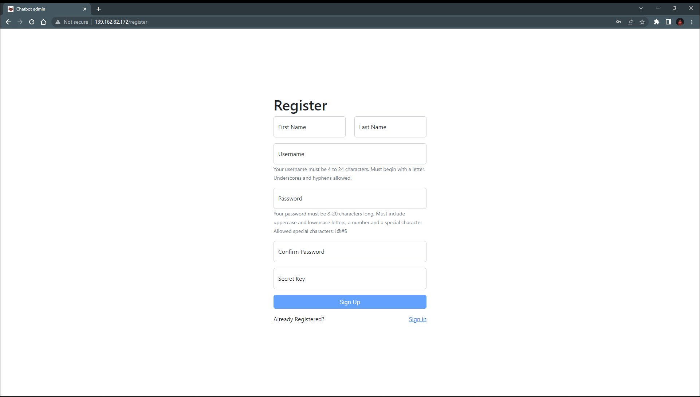
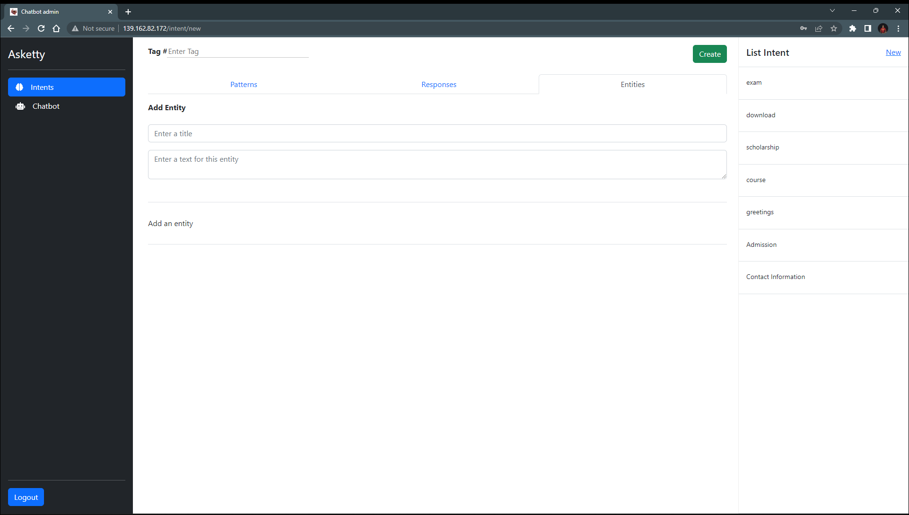
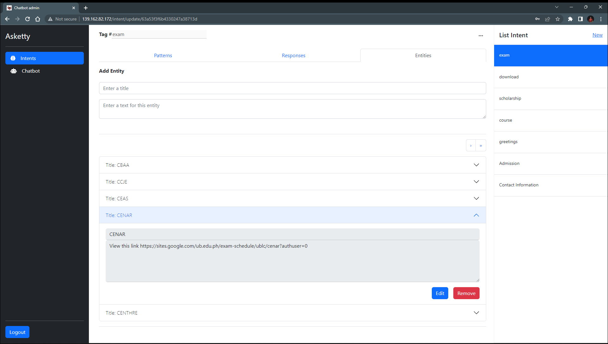
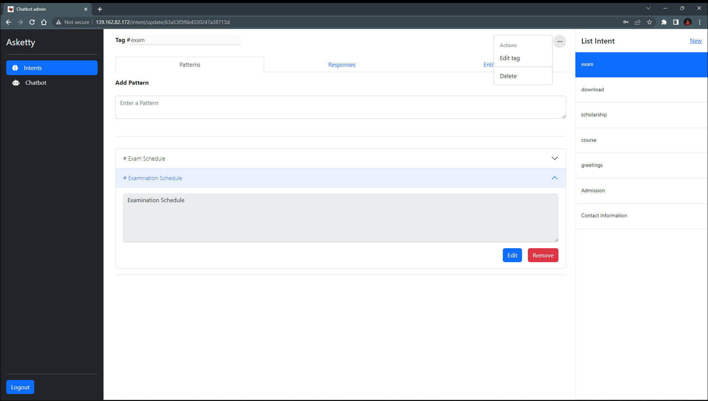
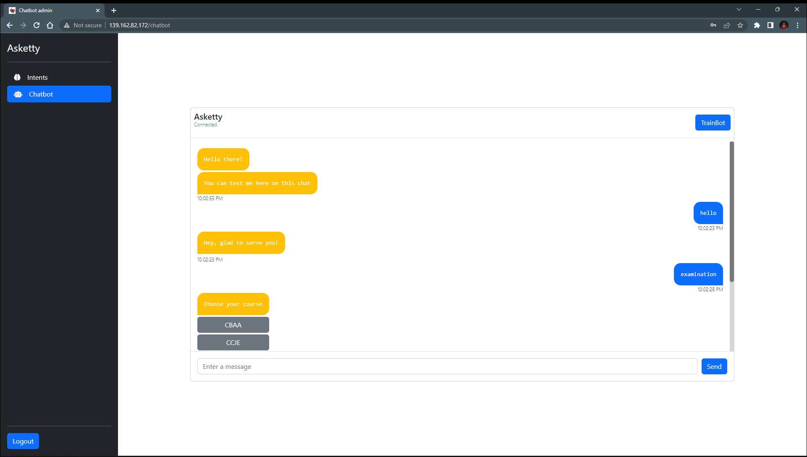
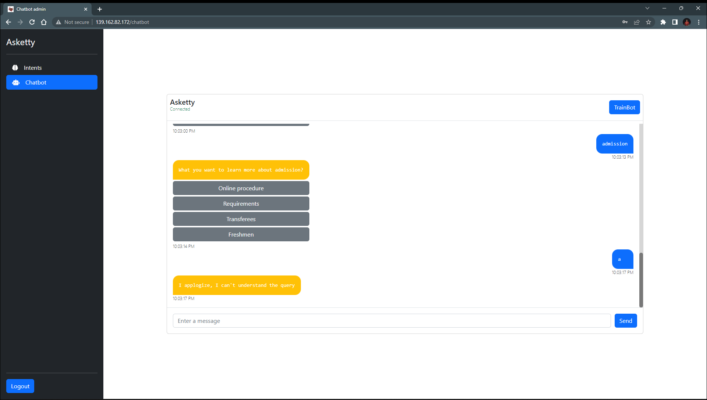
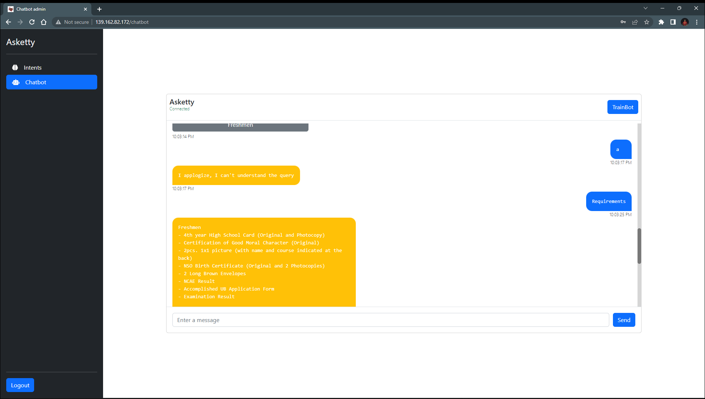

### Update:

Chatbot model training parameters can be configured.

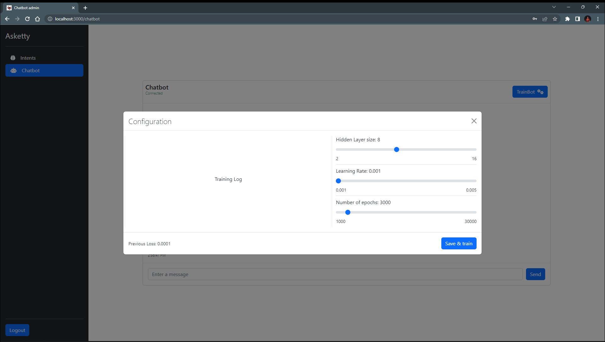

A training log is displayed on every epochs.
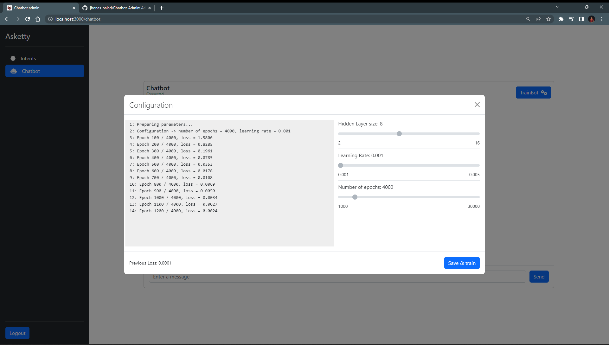

The configuration can be reset from previous training configuration
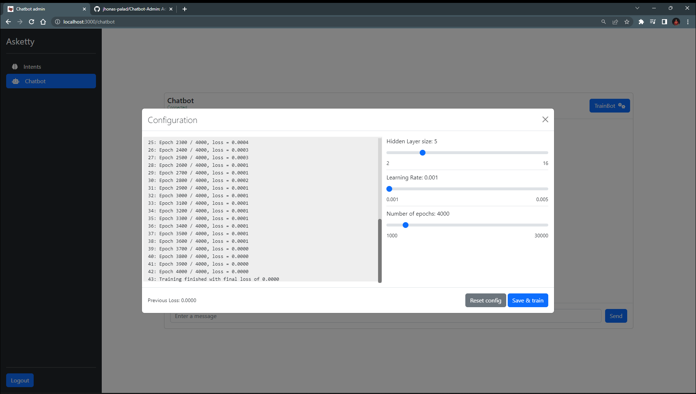

